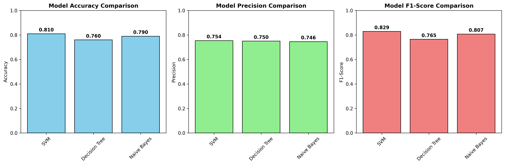

# CS4680_A1

## Overview

This project implements a machine learning classification system to predict whether a candidate is qualified to receive their driver's license based on various driving test scores and demographic information. The analysis uses three different machine learning algorithms and compares their performance using accuracy, precision, and F1-score metrics.

## Problem Statement

**Real-world Problem**: Predicting driver's license qualification based on test performance
- **Target Variable**: `Qualified` (Yes/No) - whether the candidate passes the driver's license test
- **Features**: 15 features including demographic information, test scores, and driving skills
- **Classification Type**: Binary classification (Qualified vs Not Qualified)

## Dataset Information

- **Source**: [Driver's License Test Scores Data](https://www.kaggle.com/datasets/ferdinandbaidoo/drivers-license-test-scores-data) from Kaggle
- **Total Samples**: 500 candidates
- **Features**: 15 (after preprocessing)
- **Target Distribution**: 
  - Qualified: 249 (49.8%)
  - Not Qualified: 251 (50.2%)
- **Missing Values**: 150 missing values in the 'Training' feature (handled during preprocessing)

### Features Used:
1. **Demographic**: Gender, Age Group, Race
2. **Training Level**: Training (None, Basic, Advanced)
3. **Test Scores** (0-100 scale):
   - Signals, Yield, Speed Control, Night Drive
   - Road Signs, Steer Control, Mirror Usage
   - Confidence, Parking, Theory Test
4. **Reaction Time**: Slow, Average, Fast

## Methodology

### Data Preprocessing
1. **Categorical Encoding**: Used LabelEncoder for categorical variables
2. **Feature Scaling**: Applied StandardScaler for SVM and Naive Bayes
3. **Train/Test Split**: 80/20 split (400 training, 100 testing samples)
4. **Stratified Sampling**: Maintained class distribution in both sets

### Machine Learning Models
1. **Support Vector Machine (SVM)**
   - Kernel: RBF (Radial Basis Function)
   - Uses scaled features
   - Good for non-linear decision boundaries

2. **Decision Tree**
   - Uses original features (no scaling needed)
   - Provides interpretable rules
   - Good for understanding decision patterns

3. **Naive Bayes**
   - Gaussian Naive Bayes
   - Uses scaled features
   - Assumes feature independence

### Evaluation Metrics
- **Accuracy**: Overall correctness of predictions
- **Precision**: True positives / (True positives + False positives)
- **F1-Score**: Harmonic mean of precision and recall

## How to Run

### Prerequisites
```bash
pip install pandas scikit-learn matplotlib
```

### Running the Analysis
```bash
python driver_license_classification.py
```

### Output Files
- `model_comparison.png` - Performance comparison charts

## Code Structure

The analysis is organized into the following functions:

1. `load_data()` - Data loading and initial exploration
2. `prepare_data(df)` - Data cleaning and encoding
3. `split_data(X, y)` - Train/test split with stratification
4. `scale_features(X_train, X_test)` - Feature scaling for appropriate models
5. `train_models(...)` - Training all three models
6. `evaluate_models(y_test, predictions)` - Performance evaluation
7. `create_visualizations(results)` - Visualization creation
8. `main()` - Orchestrates the entire analysis

## Results

### Model Performance Comparison

| Model | Accuracy | Precision | F1-Score |
|-------|----------|-----------|----------|
| **SVM** | **81.0%** | 75.4% | **82.9%** |
| **Decision Tree** | 76.0% | **75.0%** | 76.5% |
| **Naive Bayes** | 79.0% | 74.6% | 80.7% |  



### Key Findings

1. **Best Overall Performance**: SVM achieved the highest accuracy (81%) and F1-score (82.9%)
2. **Best Precision**: Decision Tree had the highest precision (75.0%)
3. **Consistent Performance**: All models performed well with accuracies between 76-81%
4. **Balanced Results**: All models show good balance between precision and recall

## Understanding the Results

The script will show you:
- How many people are in your dataset
- What features are being used for prediction
- How the data is split between training and testing
- Performance of each model (accuracy, precision, F1-score)
- Visual comparison of all models in bar charts

## Script Output

```
==================================================
DRIVER'S LICENSE CLASSIFICATION
==================================================
Loading dataset...
Dataset loaded: 500 rows, 17 columns
Target variable distribution:
Qualified
No     251
Yes    249

Preparing data...
  Encoded Gender: ['Female' 'Male']
  Encoded Age Group: ['Middle Age' 'Teenager' 'Young Adult']
  Encoded Race: ['Black' 'Other' 'White']
  Encoded Training: ['Advanced' 'Basic' nan]
  Encoded Reactions: ['Average' 'Fast' 'Slow']

Splitting data...
Training set: 400 samples
Testing set: 100 samples

Training models...
  Training SVM...
  Training Decision Tree...
  Training Naive Bayes...

Evaluating models...

SVM:
  Accuracy:  0.810 (81.0%)
  Precision: 0.754 (75.4%)
  F1-Score:  0.829 (82.9%)

Decision Tree:
  Accuracy:  0.760 (76.0%)
  Precision: 0.750 (75.0%)
  F1-Score:  0.765 (76.5%)

Naive Bayes:
  Accuracy:  0.790 (79.0%)
  Precision: 0.746 (74.6%)
  F1-Score:  0.807 (80.7%)

Creating visualizations...
Visualization saved as 'model_comparison.png'

==================================================
FINAL RESULTS
==================================================
Best model: SVM with 0.810 accuracy

All results:
SVM             | Accuracy: 0.810 | Precision: 0.754 | F1: 0.829
Decision Tree   | Accuracy: 0.760 | Precision: 0.750 | F1: 0.765
Naive Bayes     | Accuracy: 0.790 | Precision: 0.746 | F1: 0.807

Analysis complete!
```

## Conclusion

The analysis successfully demonstrates that machine learning can effectively predict driver's license qualification with 81% accuracy. The SVM model performs best overall, while the Decision Tree provides the most interpretable results and highest precision. 

This approach could be valuable for:
- Pre-screening candidates before expensive testing
- Identifying areas where additional training is needed
- Optimizing the driver's license testing process
- Reducing false positives and negatives in qualification decisions
